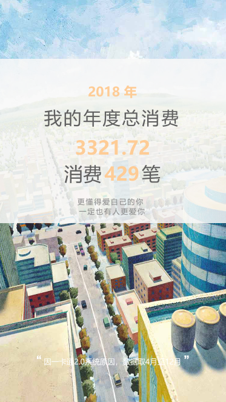

# 2018年上海大学一卡通年度账单

#### 项目历时
2018年12月25日至2018年12月31日

#### 参考
- 支付宝2017年年度账单
- [探索支付宝账单的技术实现](https://blog.csdn.net/egworkspace/article/details/79009151)
- [JHXue的年度账单](https://github.com/JHXue/bill)
- [ZweiZhao的年度账单](https://github.com/ZweiZhao/GreetingCard)

### 项目简介
通过模拟登录学校一卡通管理平台（card.shu.edu.cn)获取单笔消费信息，存入本地数据库，清洗处理返回

#### 使用技术栈
后端：nodejs+koa2+mysql  
前端：~~vue2~~  ajax  
部署：pm2管理服务端   nginx反向代理

####本地部署
git clone此项目,npm install安装相应库，npm run start 启动服后端务
#### TODO
- 由于网络请求较多，首次访问加载速度忙(大概8-10秒)，用户在数据库写入还没完成的时候再次刷新会造成数据二次写入  
    A.在前端进行限制
- 使用微信jssdk进行社交圈分享  
- 最后一页多次点击页面会卡住

##### 详细介绍见：[个人博客](http://blog.emx6.com/index.php/archives/39/)
